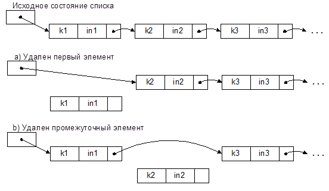
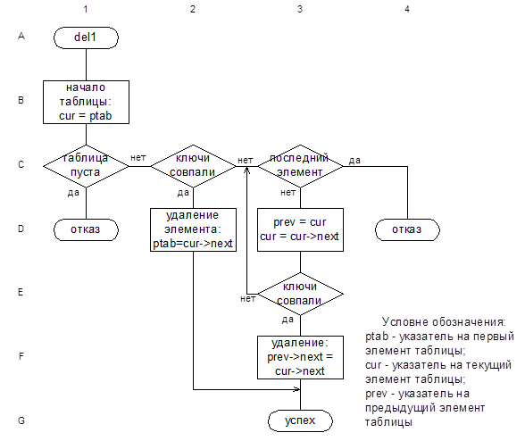

# Экзаменационный билет №17

## 1.Организация доступа по имени.

Структура памяти

- Для чтения или записи значения необходимо указать адрес элемента памяти, для человека более привычный способ указания данных - имя.

Структура данных

- Понятие таблицы...
- Пусть `К` - множество имен
- `А` - множество адресов
- тогда отношение “иметь имя” есть функция `f:К->А`

**Возможные задания `f`:возможный способ-табличное задание функции:**

1.  Таблица-последовательность строк(записей)
2.  Запись может состоять из нескольких полей
3.  Одно из полей должно задавать имя записи(ключ),остальные поля образуют тело записи.

**Операции под таблицей:**

- поиск записей по ключу
- вставка новой записи
- удаление записи

**Таблица** - динамическая структура данных.

**Базисное множество** - семейство линейных структур из записей, **базисное отношение** включения определяется операциями вставки и удаления записей.

**Варианты расширения понятия таблицы:**

- наличие нескольких ключей
- доступ по телу записей
- сложные запросы для поиска
- дополнительные операции

Принцип реализации таблиц:

- операции над таблицей не определяются(не предполагают) тот или иной порядок размещения записей в памяти ЭВМ.
- реализация таблицы должна способствовать быстрому выполнению операций(в основном доступа).....свобода в размещении записей позволяет разработать несколько способов организации таблиц.

Введение различных способов предполагает явное или неявное существование разных типов ситуаций при использовании таблиц.

Просматриваемые таблицы.

Таблица последовательности строк(записей)

**По организации способа доступа таблицы делятся на следующие категории:**

- просматриваемые таблицы
- упорядоченные таблицы
- таблицы прямого доступа
- перемешанные(хэш) таблицы

В просматриваемой таблице порядок расположения элементов никак не связан со значениями ключей (рис. II-34). Поэтому поиск элемента по ключу осуществляется обычным просмотром всех элементов таблицы, начиная с первого и до искомого

- если он есть в таблице
  - тогда поиск заканчивается успешно
- или до конца таблицы
  - тогда поиск заканчивается неуспешно

| Ключ | Информация |
| ---- | :--------: |
| 08   |    ...     |
| 33   |    ...     |
| 47   |    ...     |
| 25   |    ...     |
| 18   |    ...     |

`рис. II-34`

- При отображении просматриваемой таблицы списком не играет роли, какую – статическую или динамическую – таблицу использовать
- структура элемента таблицы (списка) будет одинакова
- При включении в таблицу новый элемент может быть размещен в любом месте таблицы (списка)
- Если некоторый элемент удаляется из списка, действия, выполняемые при этом, могут быть разными в зависимости от того, какой элемент удаляется (рис. II–38).



- Если удаляется первый элемент списка, в этом случае должен быть модифицирован указатель на начало списка (таблицы). - Если же удаляется некоторый элемент из середины списка, тогда модифицируется поле указателя предыдущего элемента (рис. II–38).

**Таким образом, при удалении элемента надо:**

- иметь доступ к предшествующему элементу списка
- различать вид предшествующего элемента.

Поскольку операция поиска возвращает искомый элемент и не сообщает о месте его размещения в списке, при реализации операции удаления элемента из списка приходится либо

- (a) повторять поиск элемента
- либо (b) следует несколько изменить реализацию операции поиска.
  - Способ (b) удобно реализуется средствами языка С/С++

Алгоритм удаления элемента из просматриваемой таблицы-списка по варианту a) приведен на рис. II–39.

- В приведенном алгоритме отдельно рассматриваются удаление первого и промежуточного элементов таблицы, поскольку это приводит к необходимости модифицировать разные структуры
  - указатель на начало таблицы при удалении первого элемента и поле указателя в элементе списка при удалении промежуточного элемента
- В результате в блоке C2 сравниваются ключи первого элемента таблицы и удаляемого элемента и, при их совпадении, в блоке D2 переопределяется указатель на начало таблицы.



- Если удаляется не первый элемент, осуществляется в цикле (блоки C3, D3, E3) поиск удаляемого элемента
- При этом используются два указателя – на текущий (cur) и на предыдущий (prev) элементы таблицы
- При совпадении ключей переопределяется поле ссылки в предыдущем элементе (на который указываетprev), в результате чего элемент удаляется из таблицы-списка.

Ниже приводится текст программы, соответствующий приведенному алгоритму.

```C++
struct Item
{
    int key;
    Type info;
    Item *next;
};
Item *ptab; /*указатель на начало таблицы */
int del1(int k)
{
    Item *cur, *prev;
    cur = ptab;
/*проверяем, есть ли в таблице элементы */
    if(!cur)
        return -1; /*таблица пуста – отказ */
/*возможно, требуется удалить первый элемент таблицы */
    if(cur->key == k)
    {
    /* удаляем первый элемент */
        ptab = cur->next;
        delInfo(cur->info);
        delete cur;
        return 0;
    }
/* ищем удаляемый элемент среди других элементов таблицы */
    while(cur->next)
    {
    /* есть другие элементы */
        prev = cur;
        cur = cur->next;
        if(cur->key == k)
        {
        /* нашли элемент, который надо удалить */
            prev->next = cur->next;
            delInfo(cur->info);
            delete cur;
            return 0;
        }
    }
/* естественный выход из цикла – в таблице нет элемента с ключом k */
    return -1;
}
```

## 2. Роль гипотез о росте структур при разработке систем управления памятью путем перепаковки.

Дерево является идеально сбалансированным если для каждого его узла количество узлов в левом и правом поддеревьях различаются не более чем на 1.
Дерево является сбалансированным,если для каждого узла высота левого и правого поддеревьев различаются не более,чем на 1(АВЛ-деревья).
Идеально сбалансированные деревья являются сбалансированными.Операции обработки сбалансированных деревьев имеют сложность log2N.(поиск,вставка,удаление)
Тmin=1
Tmax=log2N(при сбалансированном дереве)
Tmax=N(при вырожденном дереве)


